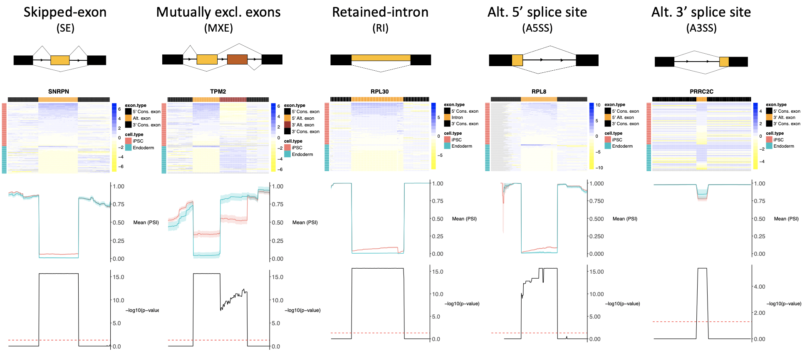

# VALERIE
MARVEL is an R package developed for visualising alternative splicing events at single-cell resolution. It complements existing genome browser to enable visualising large number of samples (cells) and large number of splicing events typical of single-cell splicing experiments.



# Installation
```
# Install VALERIE package
library(devtools)
install_github("wenweixiong/VALERIE")

# Load package
library(VALERIE)

# Launch vignette
??VALERIE
```

# Tutorial
A comprehensive tutorial for using VALERIE to visualise single-cell splicing events can be found here: https://wenweixiong.github.io/VALERIE

# Publication
We have published VALERIE in PLoS Computation Biology: https://journals.plos.org/ploscompbiol/article?id=10.1371/journal.pcbi.1008195

# Version control
**1.x.x** 
The pioneer version.

**2.0.0** 
Previously, user can specify more than 1 splicing event to plot at a time. Now, user will specify only 1 splicing event to plot at a time. This will increase the speed of reading in the BAM files and also reduce the complexity of the internal codes.

**2.0.1** 
(1) Anderson-darling added as an option for statistical testing of PSI values at each nucleotide position. User can activate this option by specifying "ad" for the _method_ argument.
(2) Included a feature to track the progress of reading in the BAM files, which is the rate-limiting step of VALERIE. Hence, user can estimate the time of completion for plotting a given splicing event. User can activate this feature by specifying _TRUE_ for the _track_ argument.
