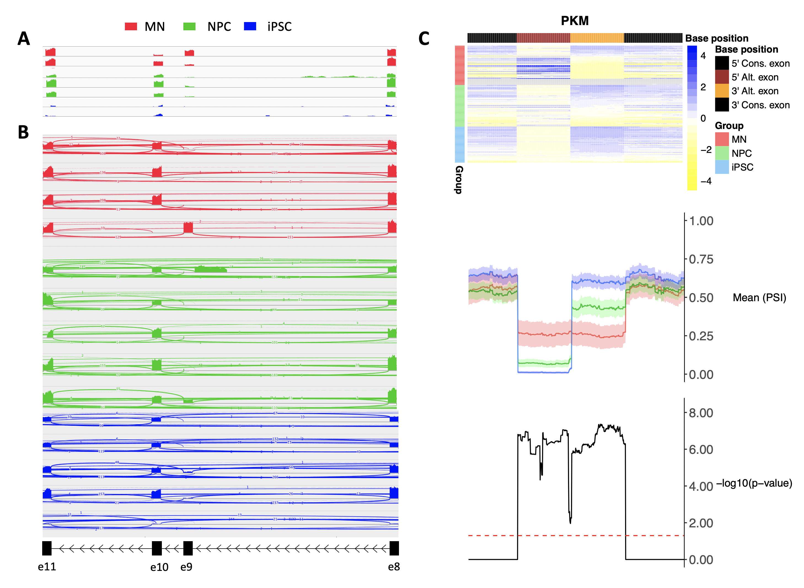

VALERIE (**V**isualising **AL**ternative splicing **E**vents from single-cell **RI**bonucleic-acid sequencing **E**xperiments) is an R package for visualizing alternative splicing events at single-cell resolution. It allows visualisation of skipped-exon (SE), mutually exclusive exons (MXE), retained-intron (RI), alternative 5' splice site (A5SS), and alternative 3' splice site (A3SS) splicing events. The main feature that makes VALERIE suitable for visualising splicing events at single-cell resolution is the presentation of splicing events as percent spliced-in (PSI) values in the form of heatmap. This allows visualisation of splicing events of hundreds or even thousands of samples typical of single-cell experiments. Furthermore, it allows overall comparison of splicing events across user-defined groups of single cells, e.g. control vs. treatment. To demonstrate the utility of VALERIE, we visualised PKM gene MXE splicing events in 63 induced pluripotent stem cells (iPSCs), 69 motor neuron cells (MNs), and 73 neural progenitor cells (NPCs) from Song et al (Mol Cell, 2018). Here, it is evident from VALERIE that PKM is differentially spliced as iPSCs differentiate into either MNs or NPCs (Figure C below). As a comparison, coverage presentation of bulk samples (Figure A) and selected number of single cells (Figure B) are shown. In summary, compared to current genome browsers, VALERIE is able to capture cell-to-cell heterogeneity in splicing events in large number of single cells.

